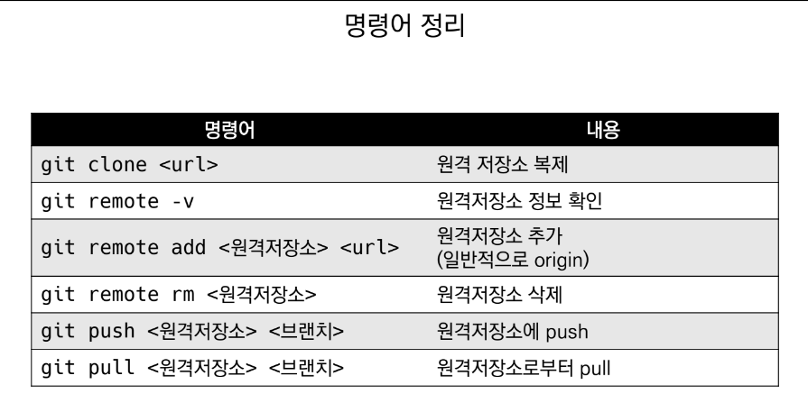
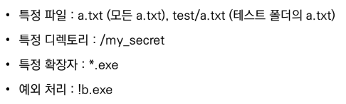
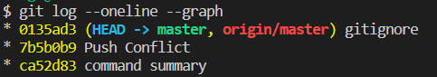
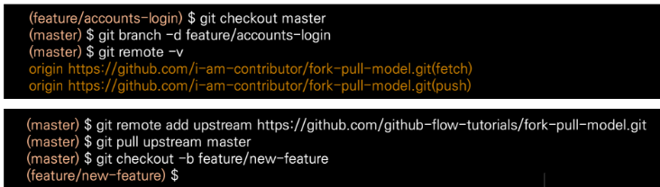

# Git 명령어 사용설명서

## 디렉토리 관련

* `ls` : 목록 출력

* `mkdir` : 디렉토리 생성

* `cd` : 디렉토리 이동

* `.` : 현재 디렉토리

* `..` : 상위 디렉토리

* `touch` : 새로운 파일 생성

* `rm 파일명` : 파일 삭제

* `rm -r 폴더명` : 디렉토리 삭제

---

## Git 저장소 관련

* `git init` : git 저장소 만들기
    * git init 할 시 **(master)** 표시가 뒤에 붙음

* `git add` : 버전을 관리하고 commit할 파일 취합

    * `add` 취소하는 방법

        ```bash
        $git restore --staged {file name}
        ```

* `git commit -m` : commit 실행 (파일의 새 버전이 기록됨)

    * `commit message` 수정 방법

        ```bash
        $git commit --amend
        ```

        ***하지만 해시값이 바뀌므로 함부로 수정하지 않는다!***

* `git status` : 현재 상태 표시

* `git log` : 현재까지 commit한 기록 출력

*-2022.12.27*

***

## 원격저장소 명령어 사용설명서

* `로컬 저장소에 원격저장소 정보 설정`
    ```bash
    $git remote add origin '주소'
    ```

* `원격 저장소의 정보 확인`
    ```bash
    $git remote -v
    ```

* `push` 명령어
    ```bash
    $git push '원격저장소 이름' '브랜치 이름'

    # 예시
    $git push origin master
    ```

* `pull` 명령어
    * 원격저장소 커밋 가져오기
    ```bash
    $git pull '원격저장소 이름' '브랜치 이름'

    # 예시
    $git pull origin master
    ```

* `clone` 명령어
    * 원격저장소 복제
    * 이전의 모든 history까지 가져올 수 있음
    * *주의*
        * 로컬에서 새로운 프로젝트 시작은 git init
        * 원격에 있는 프로젝트 시작은 git clone

    ```bash
    $git clone '원격저장소 주소'
    ```

* **`SUMMARY`**
    

***

## Push Conflict

* 로컬과 원격 저장소의 `커밋 이력 상이할 때` 발생

* `해결 방법`
    1. 원격저장소의 커밋을 pull
    2. 로컬에서 두 커밋 병합
        - 동시에 같은 파일 수정됐을 경우 브랜치로 해결 (추후 학습)
    3. 다시 GitHub로 push

***

## .gitignore

* 버전 관리 하지 않는 파일/디렉토리 대상

* Git 저장소에 `.gitignore` 파일 생성 후 목록 작성

* 예시

    

***

## git log

* 실행 시 현재 사용 중인 저장소의 모든 변경 이력 출력

* `--oneline --graph` 명령어 사용 시 커밋의 병합 볼 수 있음
    

*-2022.12.28*

***

## Branch

* **What is Branch?**
    
    협업을 위해 독립적인 버전의 흐름을 만들기 위해 사용

* `브랜치 생성` 명령어

    ```bash
    (master) $git branch {branch name}
    ```

* `브랜치 이동` 명령어

    ```bash
    (master) $git checkout {branch name}
    ```

* `브랜치 생성 및 이동` 명령어

    ```bash
    (master) $git checkout -b {branch name}
    ```

* `브랜치 목록` 명령어

    ```bash
    (master) $git branch
    ```

* `브랜치 삭제` 명령어

    ```bash
    (master) $git branch -d {branch name}
    ```

***

## Merge

* **What is Merge?**

    각 branch에서 작업 이후 이력 합치기 위해 사용

* `Fast Forward`

    * 기존 master 브랜치에 변경사항이 없어 단순히 앞으로 이동

* `Merge Commit`

    * 기존 master 브랜치에 변경사항이 있어 병합 커밋 발생

    ```bash
    (master) $git merge {branch name}
    ```

* `Merge Conflict`

    * 해결 방법
       
        1. 충돌
        2. 파일 확인 (git status) 후 수정
        3. add
        4. commit
        5. 충돌 해결


***

## Git Flow

* **What is Git Flow?**

    Git을 활용하여 협업하는 흐름
    
    Branch를 활용하는 전략 의미

* 기본 원칙

    1. `Master Branch`는 반드시 배포 가능한 상태

    2. `Feature Branch`는 각 기능의 의도를 알 수 있도록 작성

    3. `Commit Message`는 매우 중요하며, 명확하게 작성

    4. `Pull Request` 통해 협업 진행

    5. Master Branch에 `Merge`하여 변경사항 반영

* GitHub Flow Models

    * `Shared Repository Model`

        * 동일한 저장소 공유하여 활용하는 방식

        * Collaborator 초대 후 git clone

        * 작업은 항상 독립적인 feature branch에서 함

        * Commit으로 작업의 이력 남김

        * 완성된 코드는 원격 저장소에 push

        * PR

        * 작성된 코드 review 후 merge

        * 로컬에서 merge된 branch 삭제 후 master branch 업데이트 (git pull origin master)

    * `Fork & Pull Model`

        * Collaborator에 등록되지 않은 상태에서 개발 진행

        * 원격 저장소를 fork

        * Clone 진행

        * 이후 작업은 Shared Repository Model과 동일

        * Merge 이후 로컬에서 merge된 branch 삭제, master branch 업데이트

            * 단, master branch는 원본 저장소를 받아와야 하며, 별도의 원격 저장소를 추가하여 진행할 수 있음

            * 또는, GitHub에서 fetch upstream도 가능

            * 예시

                

*-2022.12.29*

***

