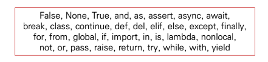
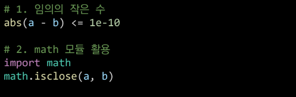
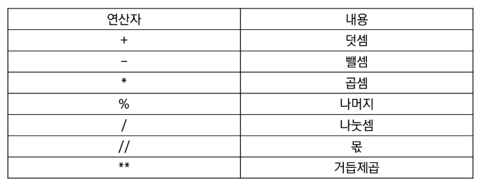
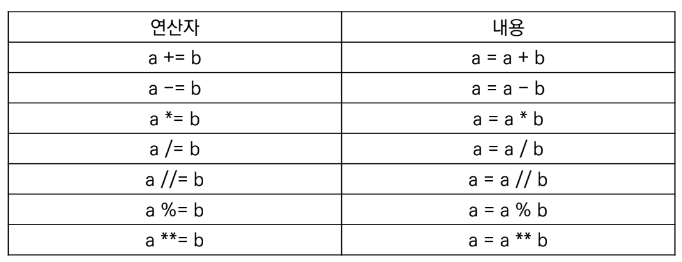
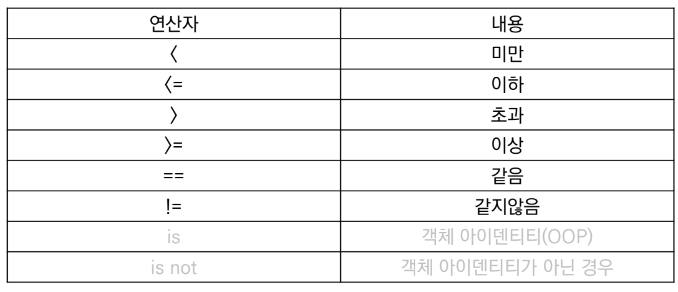
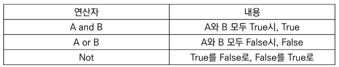
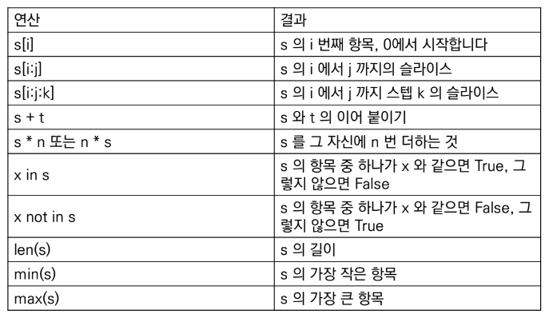
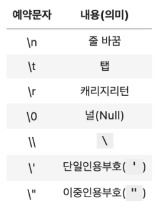

# Python 기초

## 1. Python?

* Easy to learn

* Expressive Language

* 크로스 플랫폼 언어

* 인터프리터 언어
    * 소스코드를 기계어로 변환하는 컴파일 과정 없이 바로 실행 가능

    * 한 줄 입력 >> 실행 >> 바로 확인 가능

* **객체 지향 프로그래밍**

</br>

## 2. 변수

* `type()` : 변수에 할당된 값의 타입

* `id()` : 변수에 할당된 값(객체)의 고유한 아이덴티티 값 / 메모리 주소

* **변수 할당**

    * 같은 값을 동시에 할당 가능

        ```python
        x = y = 1004
        ```
    
    * 다른 값을 동시에 할당 가능

        ```python
        x, y = 1, 2
        ```

* **식별자**

    * 파이썬 객체를 식별하는 데 사용하는 이름

    * 다음 키워드는 예약어로, 식별자로 사용 금지

        

    * 내장함수나 모듈 등의 이름으로도 만들기 금지

</br>

## 3. 자료형
    
* **숫자**

    * 수치형 : `int` `float` `complex`

    * 불린형

* **시퀀스**

    * 문자열
    
    * 튜플

    * 리스트

    * 레인지

* **컬렉션**

    * 집합

    * 딕셔너리

* **None**

</br>

## 4. 수치형

* **정수**

    * 모든 정수의 타입은 int

    * 오버플로우 발생 X

* **실수**

    * 정수 아닌 모든 실수 타입은 float

    * 부동소수점

        * `Floating point rounding error`
        
            값 비교하는 과정에서 정수 아닌 실수인 경우 주의

            매우 작은 수보다 작은지를 확인하거나 math 모듈 사용

            

* **복소수**

    * 실수부 + 허수부 (j로 표현)

</br>

## 5. 불린형

* True / False 값을 가진 타입

* `True == 1`

* `False == 0`

* 비교/논리 연산 수행에 활용

* `0` `0.0` `()` `[]` `{}` `None` : 모두 `False`로 변환

</br>

## 6. 연산자

* **산술 연산자**

    

* **복합 연산자**

    

* **비교 연산자**

    

* **논리 연산자**

    
    
</br>

## 7. 컨테이너

* 여러 개의 값을 담을 수 있는 객체

* 분류

    * `순서 있는 데이터` vs `순서 없는 데이터`

    * 순서 있다 != 정렬되어 있다

</br>

## 8. 시퀀스형 컨테이너

* 시퀀스형 주요 공통 연산자

    

* **문자열**

    * 작은 따옴표 or 큰 따옴표 활용

    * **중첩따옴표**

        * 따옴표 안에 작은 따옴표 : 큰 따옴표로 문자열 생성

        * 따옴표 안에 큰 따옴표 : 작은 따옴표로 문자열 생성

    * **삼중따옴표**

        * 따옴표 안에 따옴표를 넣을 때

        * 여러 줄 나눠 입력할 때 편리

    * **인덱싱**

        * 특정 값에 접근 가능

    * **슬라이싱**

        * s[i:j] : i 번째 문자부터 (j-1) 번째 문자까지

        * s[i:j:k] : i 번째 문자부터 (j-1) 번째 문자까지 k 만큼 건너뛰기

    * **기타**

        * 결합 (+)

        * 반복 (*)

        * 포함 (in) : 출력값이 불린형

    * **Escape Sequence**

        * 문자열 내 특정 문자나 조작을 위해 역슬래시 활용하여 구분

        

    * 특징

        * Immutable (변경 불가)

        * Iterable (반복 가능)

* **리스트**

    * 변경 가능한 값들의 나열된 자료형

    * 순서 가지며, 서로 다른 타입의 요소 가질 수 있음

    * 변경 가능, 반복 가능

    * `[]` 혹은 `list()` 를 통해 생성

    * 인덱스를 통해 접근 가능

    * `.append()` : 리스트의 마지막에 값 추가

    * `.pop()` : 리스트의 삭제하고자 하는 인덱스 전달

* **None**

    * 값이 없음을 표현하기 위한 자료형

    * 일반적으로 반환값 없는 함수에서 사용하기도 함

</br>

## 9. 파이썬 시작하기

* **주석**

    * 주석 처리 내용 앞에 `#` 입력

    * 여러 줄일 경우 코드의 앞뒤로 작은 따옴표 or 큰 따옴표 세 개씩 입력

    * VS Code에서 단축키 `ctrl + /` 활용해 단체 주석 처리 가능

* **사용자 입출력**

    * `input([prompt])` : 반환값은 항상 문자열의 형태

    * `print()` : 변수의 경우 변수 값 출력, 객체별 표현 방식에 따라 출력함