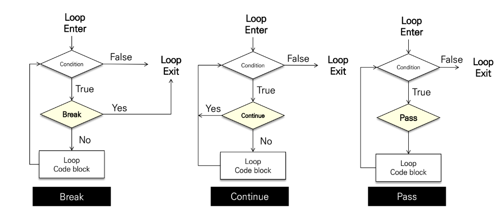

# 제어문

## 1. 복수 조건문

* `if` `elif` `else` 사용

* 예제 - 미세먼지 농도에 따른 등급 출력

    ```python
    dust = 80

    if dust > 150:
        print('매우 나쁨')
    elif dust > 80:
        print('나쁨')
    elif dust > 30:
        print('보통')
    else:
        print('좋음')
    print('미세먼지 확인 완료')

    # 보통
    ```

    * `150 >= dust > 80` 과 같이 쓰지 않은 이유
        
        조건식을 동시에 검사하는 것이 아니라 순차적으로 비교하기 때문!

</br>

## 2. 중첩 조건문

* 조건문 안에 조건문 중첩 사용 가능

* 예제 - 미세먼지 농도 문제

    ```python
    dust = -10

    if dust > 150:
        print('매우 나쁨')
        if dust > 300:
            print('실외 활동을 자제하세요.')
    elif dust > 80:
        print('나쁨')
    elif dust > 30:
        print('보통')
    else:
        if dust >= 0:
            print('좋음')
        else:
            print('값이 잘못되었습니다.')
    ```

</br>

## 3. Range

* 숫자의 시퀀스 나타내기 위해 사용

* `range(n)` : 0부터 (n-1)까지의 숫자 시퀀스

* `range(n, m)` : n부터 (m-1)까지의 숫자 시퀀스

* `range(n, m, s)` : n부터 (m-1)까지 s만큼 증가시키는 숫자 시퀀스

* 변경 불가능, 반복 가능

* 예시

    ```python
    # 0부터 특정 숫자까지
    list(range(3))  # [0, 1, 2]

    # 숫자의 범위
    list(range(1, 5))   # [1, 2, 3, 4]

    # step의 활용
    list(range(1, 5, 2))    # [1, 3]

    # 역순
    list(range(6, 1, -1))   # [6, 5, 4, 3, 2]

    list(range(6, 1, 1))    # []
    ```

</br>

# 4. 반복문

* 종류

    * `while` : 종료 조건에 해당하는 코드를 통해 반복문 종료
    
    * `for` : 반복 가능한 객체를 모두 순회하면 종료 (별도의 종료 조건 필요 X)
    
    * `break` `continue` `for-else` : 반복 제어

</br>

# 5. while 문

* 조건식이 참인 경우 반복적으로 코드 실행

* 예제 - 사용자가 입력한 양의 정수까지의 총합

    ```python
    # 값 초기화
    n = 0
    total = 0
    user_input = int(input())

    while (n <= user_input):
        total += n
        n += 1
    
    print(total)
    ```

</br>

# 6. for 문

* 시퀀스 (string, tuple, list, range)를 포함한 순회 가능한 객체를 모두 순회

    * 순회 가능한 객체 : 컨테이너형 (문자열, 리스트, 튜플, range, set, dictionary) 등

* 문자열 순회

    * 예제

        ```python
        # 사용자가 입력한 문자를 한 글자씩 세로로 출력
        chars = input()

        for char in chars:
            print(char)
        ```

        ```python
        # 사용자가 입력한 문자를 range 활용해 한 글자씩 출력
        chars = input()

        for idx in range(len(chars)):
            print(chars[idx])
        ```

</br>

## 7. 반복문 제어

* `break` : 반복문을 종료

* `continue` : continue 이후의 코드 블록은 수행하지 않고, 다음 반복을 수행

* `for-else` : 끝까지 반복문 실행한 이후 else문 실행
    
    * break 통해 중간에 종료되는 경우 else 문은 실행되지 X

</br>



