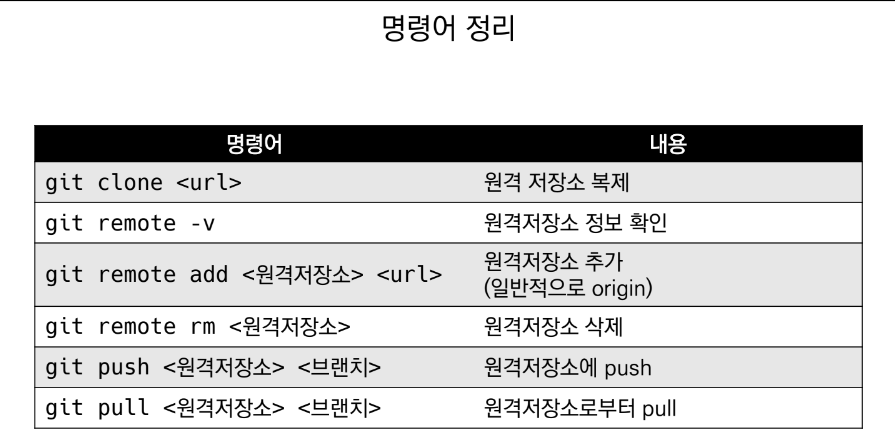

# 221228 TIL

## Git 명령어 사용설명서

* `로컬 저장소에 원격저장소 정보 설정`
    ```bash
    $git remote add origin '주소'
    ```

* `원격 저장소의 정보 확인`
    ```bash
    $git remote -v
    ```

* `push` 명령어
    ```bash
    $git push '원격저장소 이름' '브랜치 이름'

    # 예시
    $git push origin master
    ```

* `pull` 명령어
    * 원격저장소 커밋 가져오기
    ```bash
    $git pull '원격저장소 이름' '브랜치 이름'

    # 예시
    $git pull origin master
    ```

* `clone` 명령어
    * 원격저장소 복제
    * 이전의 모든 history까지 가져올 수 있음
    * *주의*
        * 로컬에서 새로운 프로젝트 시작은 git init
        * 원격에 있는 프로젝트 시작은 git clone

    ```bash
    $git clone '원격저장소 주소'
    ```

* **`SUMMARY`**
    

***

## Push Conflict

* 로컬과 원격 저장소의 `커밋 이력 상이할 때` 발생

* `해결 방법`
    1. 원격저장소의 커밋을 pull
    2. 로컬에서 두 커밋 병합
        - 동시에 같은 파일 수정됐을 경우 브랜치로 해결 (추후 학습)
    3. 다시 GitHub로 push

***

