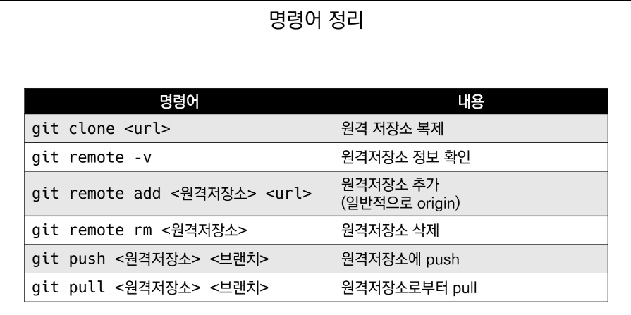

# Git 명령어 사용설명서

## 디렉토리 관련

* `ls` : 목록 출력

* `mkdir` : 디렉토리 생성

* `cd` : 디렉토리 이동

* `.` : 현재 디렉토리

* `..` : 상위 디렉토리

* `touch` : 새로운 파일 생성

* `rm 파일명` : 파일 삭제

* `rm -r 폴더명` : 디렉토리 삭제

---

## Git 저장소 관련

* `git init` : git 저장소 만들기
    * git init 할 시 **(master)** 표시가 뒤에 붙음

* `git add` : 버전을 관리하고 commit할 파일 취합

* `git commit -m` : commit 실행 (파일의 새 버전이 기록됨)

* `git status` : 현재 상태 표시

* `git log` : 현재까지 commit한 기록 출력

*-2022.12.27*

***

## 원격저장소 명령어 사용설명서

* `로컬 저장소에 원격저장소 정보 설정`
    ```bash
    $git remote add origin '주소'
    ```

* `원격 저장소의 정보 확인`
    ```bash
    $git remote -v
    ```

* `push` 명령어
    ```bash
    $git push '원격저장소 이름' '브랜치 이름'

    # 예시
    $git push origin master
    ```

* `pull` 명령어
    * 원격저장소 커밋 가져오기
    ```bash
    $git pull '원격저장소 이름' '브랜치 이름'

    # 예시
    $git pull origin master
    ```

* `clone` 명령어
    * 원격저장소 복제
    * 이전의 모든 history까지 가져올 수 있음
    * *주의*
        * 로컬에서 새로운 프로젝트 시작은 git init
        * 원격에 있는 프로젝트 시작은 git clone

    ```bash
    $git clone '원격저장소 주소'
    ```

* **`SUMMARY`**
    

***

## Push Conflict

* 로컬과 원격 저장소의 `커밋 이력 상이할 때` 발생

* `해결 방법`
    1. 원격저장소의 커밋을 pull
    2. 로컬에서 두 커밋 병합
        - 동시에 같은 파일 수정됐을 경우 브랜치로 해결 (추후 학습)
    3. 다시 GitHub로 push

***

## .gitignore

* 버전 관리 하지 않는 파일/디렉토리 대상

* Git 저장소에 `.gitignore` 파일 생성 후 목록 작성

* 예시

    

***

## git log

* 실행 시 현재 사용 중인 저장소의 모든 변경 이력 출력

* `--oneline --graph` 명령어 사용 시 커밋의 병합 볼 수 있음
    

*-2022.12.28*

***